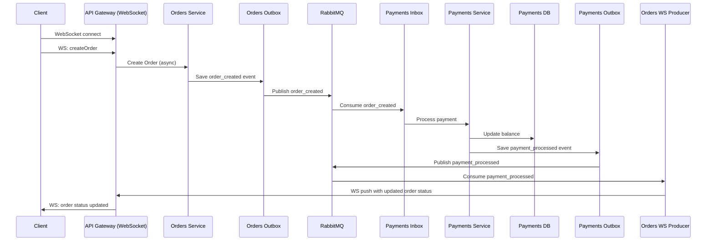

# hse-payord

## API Docs

**[Postman Collection](https://web.postman.co/workspace/d3b4d30f-3bd9-4ad3-ae0c-87535d10ed59)**

---

## Launch

```bash
cd docker
docker compose up
```
You can test the application after all containers are up.

---

## Features

### Order Service

- View list of orders for a user
- View individual order status
- Create new order (async payment processing, WS)
- Initiate payment (Transactional Outbox)

### Payment Service

- Create a user account
- Deposit
- Check balance
- Asynchronous payment processing (Transactional Inbox and Outbox)
- Atomic balance updates (CAS)

### Common

- All messages delivered via RabbitMQ
- Traefik as API Gateway
- Containerized in Docker
- Frontend client for simulation
- WebSocket for real-time order status updates

---

## Create Order flow



---

## Dashboards and Interfaces

- **Web UI**: [http://localhost:3000](http://localhost:3000)
- **RabbitMQ UI**: [http://localhost:15672](http://localhost:15672) (creds: admin/secret)
- **Traefik Dashboard**: [http://localhost:8080](http://localhost:8080)
